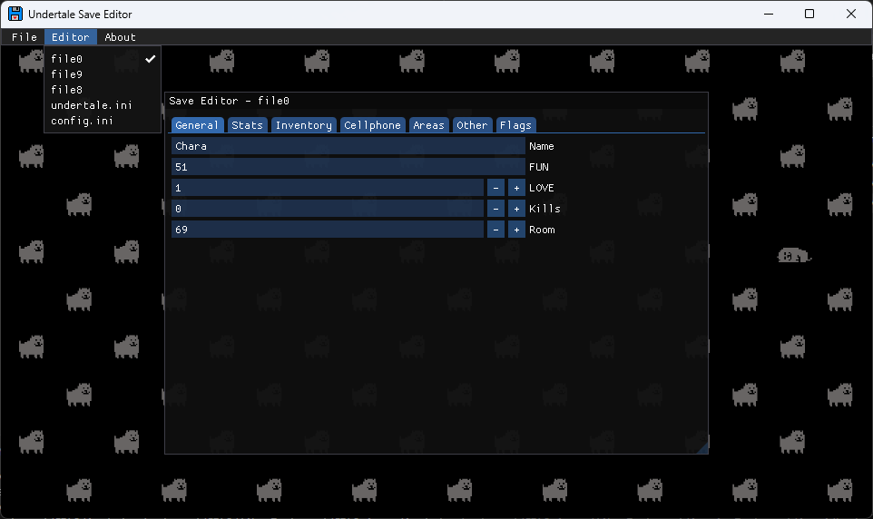

## Undertale Save Editor
Yet-Another-UT-Save-Editor written in C++ using ImGui because why not.

## Features
* Supports reading both PC and Console *.sav files.
* Converts from PC to Console saves and vice-versa.
* Aside from that, it's just another UT Save Editor.

## Credits
* [ImGui](https://github.com/ocornut/imgui)
* [SDL2](https://github.com/libsdl-org/SDL)
* [SDL_image](https://github.com/libsdl-org/SDL_image)
* [Native File Dialog Extended](https://github.com/btzy/nativefiledialog-extended)
* [nlohmann JSON](https://github.com/nlohmann/json)
* [mINI](https://github.com/metayeti/mINI)
* [tomat.dev](https://tomat.dev/undertale/save)

## TODO
* Detailed items and flags.
* Linux/macOS support (maybe).